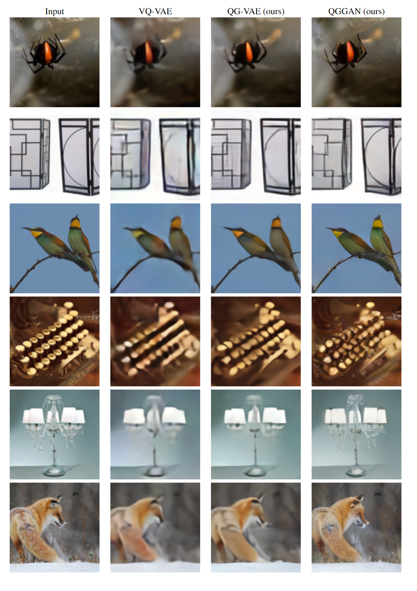

<table>
  <tr>
    <td></td>
    <td>This is the (preliminary) code for the paper <a href="https://arxiv.org/abs/2407.11913">"Quantised Global Autoencoder: A Holistic Approach to Representing Visual Data"</a>.  Everything else will follow soon(tm)  The "demo.ipynb" notebook contains a minimal version, <b>without</b> additional sharpening (QGGAN), and without lightning speedups that make our code viable.  QGGAN.ipynb contains what we used for our experiments, including lightning and the option to add an additional sharpening (QGGAN). Use it after you read & understood the "demo"-file!</td>
  </tr>
</table>

